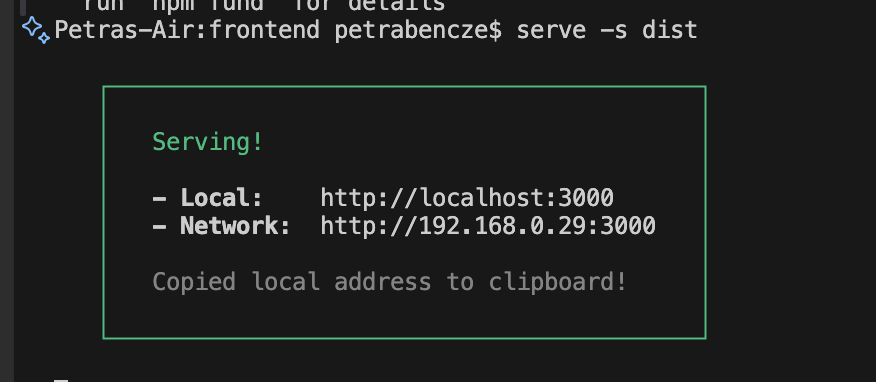

# Transcendence – Frontend

This project is a single-page application built with modern, lightweight tooling.
It uses **React**, **TypeScript**, **Vite**, and **TailwindCSS**, with **Husky** + **lint-staged** to ensure clean commits and consistent code quality.

## Tech Stack

| Tool                  | Purpose                                  |
| --------------------- | ---------------------------------------- |
| **React**             | UI framework                             |
| **TypeScript**        | Type-safe JavaScript                     |
| **Vite**              | Ultra-fast build tool + local dev server |
| **TailwindCSS**       | Utility-first styling                    |
| **Husky**             | Git hooks                                |
| **lint-staged**       | Run linters only on staged files         |
| **ESLint + Prettier** | Ensures consistent code style            |

## Project Structure

```bash
frontend/
│
├── src/
│   ├── assets/         # Images, static content
│   ├── components/     # Reusable components
│   ├── pages/          # Route-based pages
│   ├── App.tsx
│   ├── main.tsx
│   ├── index.css
|   ├── Dockerfile.dev  # Dockerfile for development
|   ├── Dockerfile      # Dockerfile for production
|   ├──docker-compose.yml
|   |__ nginx/
|       |__ nginx.conf
│
├── public/             # Static files
├── tsconfig.json
├── vite.config.ts
└── tailwind.config.js
```

## Setup & Installation

1. Clone the repository
   `git clone <your-repo-url>`
   `cd frontend`

2. Install node if not installed (needed for `npm`)

- follow this guide: [https://nodejs.org/en/download](https://nodejs.org/en/download)

3. Install dependencies
   `npm install`

4. Development

Start the local dev server:
`npm run dev`
The app will be available at:
[http://localhost:5173](http://localhost:5173)

Building for Production
`npm run build`

Preview the production build locally:
`npm run preview`
Or:
`npm install serve -g`
`serve -s dist`


5. Dockerization
   To run the dockerized local dev server, run:
   `docker compose up frontend-dev`
   Open:
   `http://localhost:5173/`

To build for production, run:
`docker compose up frontend-prod`
Open:
`http://localhost:8080`

## TailwindCSS

Tailwind is already configured.
You can use utilities directly in your components:

```js
export default function App() {
	return <h1 className='text-3xl font-bold text-blue-600'>Hello world!</h1>;
}
```

## Code Quality (ESLint + Prettier)

Run linting manually:
`npm run lint`
`npx prettier --write .`

## Husky & lint-staged

This project includes a pre-commit hook that automatically:
formats staged files with **Prettier**
runs **ESLint** with `--fix` on staged files

To reinstall Husky hooks (e.g., after cloning):
`npm run prepare`

During commits, you should see something like:

```bash
⚠ Running tasks for staged files...
✔ prettier --write
✔ eslint --fix
```

-> Commits will fail if linting or formatting cannot succeed.

## Resources

- [How to Dockerize a React + Vite app? – Medium Article](https://thedkpatel.medium.com/dockerizing-react-application-built-with-vite-a-simple-guide-4c41eb09defa)
- [How to Dockerize a React + Vite app? – Official Docs](https://docs.docker.com/guides/reactjs/containerize/)
- [Docker.dev](https://docs.docker.com/guides/reactjs/containerize/)
